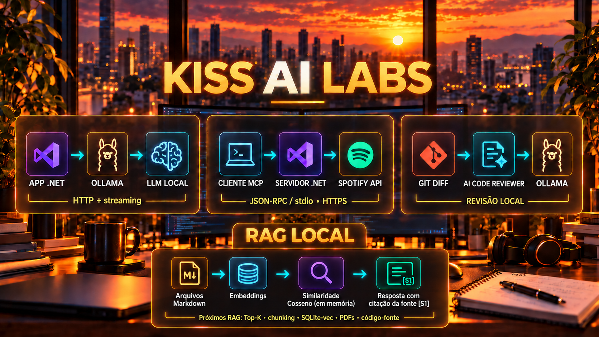

# 05 — RAG sobre Código-Fonte



Localize regras e classes em arquivos C# usando embeddings locais e similaridade de cosseno. O fluxo continua explícito: arquivos `.cs` → embeddings → ranking em memória → Top-K → resposta com fontes.

## Executar

Pré-requisitos: SDK .NET 11 (preview com suporte a `net11.0`), Ollama em execução e modelos baixados. Execute na raiz do repositório:

```bash
ollama pull nomic-embed-text
ollama pull llama3.2
dotnet build 05-rag-source-code/src/RagSourceCode.csproj
dotnet run --project 05-rag-source-code/src -- --question "Qual classe valida o limite de desconto de um pedido?" --top-k 2
dotnet run --project 05-rag-source-code/src -- --question "Onde a regra de desconto é aplicada?" --top-k 2
```

Confira `DiscountPolicy.cs` (valida descontos entre 0 e 20%) e `OrderService.cs` (chama a validação antes do cálculo). `ShippingPolicy.cs` oferece outro assunto para observar ruído no ranking. Esses arquivos são dados de exemplo; não são executados pelo RAG.

Para consultar seu código:

```bash
dotnet run --project 05-rag-source-code/src -- --code ./meu-projeto --question "Qual classe faz essa validação?" --top-k 3
```

Opções: `--code`, `--question`, `--top-k`, `--url`, `--embedding-model`, `--model`, `--cpu`, `--help`. Padrões: pasta `05-rag-source-code/samples`, K=2, endpoint `http://localhost:11434`, modelos `nomic-embed-text` e `llama3.2`. K deve ser positivo; acima do total recupera todos os arquivos disponíveis.

Se ocorrer `prediction aborted, token repeat limit reached`, tente `--cpu` para executar embeddings e geração na CPU. Esse modo resolveu a falha observada neste ambiente; pode ser mais lento. Exemplo:

```bash
dotnet run --project 05-rag-source-code/src -- --question "Onde a regra de desconto é aplicada?" --top-k 2 --cpu
```

## O que observar

O console imprime os arquivos recuperados, cosseno, contexto completo, resposta e fontes `[S1]` com caminho relativo e intervalo `arquivo.cs:1-N`. Cada arquivo inteiro é uma unidade de recuperação; o intervalo identifica a fonte completa, não a linha exata da regra. Confira a chamada e a validação no código original. IDs citados pelo LLM não são validados automaticamente.

A busca é recursiva, aceita `.cs` e `.CS`, ignora `bin`, `obj`, `.git`, `.vs`, `node_modules` e não segue links de arquivos ou diretórios. Não usa Roslyn, grafo de chamadas, banco vetorial, persistência, chunking nem filtro de similaridade. Por isso pode recuperar arquivos irrelevantes ou deixar de encontrar uma chamada: similaridade não prova relação entre classes.

## Dados e limites

O texto completo dos arquivos e a pergunta são enviados ao endpoint para embeddings; os arquivos recuperados e a pergunta são enviados para geração. Endpoint e modelos locais mantêm esse processamento na máquina. Com endpoint remoto, esses textos seguem para o servidor configurado. O contexto também aparece no terminal.

Embeddings são recalculados a cada execução. Arquivos grandes podem exceder a janela do embedding (truncamento desativado); selecione uma pasta pequena. A geração é limitada a 384 tokens e à janela do modelo. Temperatura zero e seed fixa não garantem precisão ou determinismo.

Pasta ausente, vazia, opções inválidas e falhas de leitura retornam código 1 com mensagem. Conexão recusada ou modelo ausente: confira Ollama, `--url` e os modelos baixados. Use `--help` para consultar opções.

## Validação

```powershell
pwsh -File 05-rag-source-code/tests/validate.ps1
```

O teste HTTP sem modelos verifica descoberta recursiva, exclusão de pastas geradas, ranking, fontes com linhas, contexto, limite de K e erros de entrada. Não mede qualidade semântica. Consulte [VALIDATION.md](VALIDATION.md) e [SPEC.md](SPEC.md).
