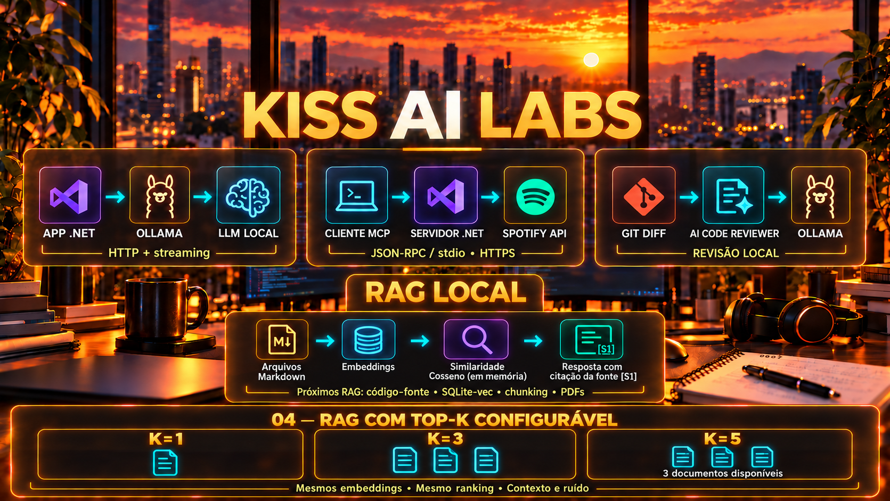

# KISS AI Labs



**Laboratório prático de IA local em .NET: da primeira chamada a um LLM à recuperação semântica sobre seus documentos.**

Aprenda construindo aplicações pequenas em C# e .NET 11: converse com modelos pelo Ollama, exponha ferramentas via MCP, revise diffs do Git e faça perguntas sobre arquivos Markdown com RAG. Cada laboratório mostra o fluxo no código e tem uma especificação para orientar a implementação.

[Começar agora](#comece-aqui) · [Trilha de aprendizado](#trilha-de-aprendizado) · [Demo RAG](#demonstração-principal-rag-local) · [Roadmap](#roadmap) · [Contribuir](#como-contribuir)

> **KISS — Keep It Simple, Stupid.** Exemplos pequenos, chamadas HTTP explícitas e poucas peças para entender cada etapa. A complexidade deve servir ao conceito que o laboratório ensina.

## Para quem é

- **Desenvolvedores .NET** que querem integrar IA a aplicações usando C#, HTTP e JSON.
- **Estudantes e pessoas em transição para engenharia de IA** que querem entender geração, ferramentas e recuperação semântica por meio de código executável.
- **Quem aprende experimentando** e prefere ler um programa pequeno, mudar uma entrada e observar o resultado.

Conhecimentos básicos de C#, terminal e HTTP ajudam a acompanhar os exemplos. Os projetos são didáticos; servem como ponto de partida para experimentos e discussões técnicas.

## O que você vai aprender

| Conceito | Experiência prática |
|---|---|
| Inferência local | Chamar o Ollama com `HttpClient` e receber respostas em streaming |
| Ferramentas para IA | Implementar um servidor MCP didático com JSON-RPC sobre stdio |
| Contexto aplicado a uma tarefa | Enviar um diff do Git ao modelo para apoiar uma revisão de código |
| Recuperação semântica | Gerar embeddings e ordenar documentos por similaridade de cosseno |
| RAG | Combinar pergunta e documentos recuperados para gerar uma resposta |
| Limites e rastreabilidade | Comparar Top-K e conferir os arquivos apresentados como fontes |
| Desenvolvimento orientado por especificação | Relacionar requisitos de `SPEC.md` ao comportamento da aplicação |

Esses exercícios ajudam a praticar decisões que aparecem no trabalho com IA: qual contexto enviar, onde os dados são processados, como integrar ferramentas e como avaliar uma resposta. Para transformar um lab em um projeto de portfólio, registre a pergunta usada, o resultado observado, as limitações e as decisões de implementação.

## Trilha de aprendizado

Siga a sequência **00 → 01 → 02 → 03 → 04**. Cada laboratório é independente e tem seu próprio guia.

| Etapa | Laboratório | O que você constrói | Tecnologias e pré-requisitos específicos |
|---|---|---|---|
| 00 — Fundamentos | [Hello Ollama](00-hello-ollama/README.md) | Console que conversa com um LLM e exibe a resposta em streaming | .NET 11, `HttpClient`, Ollama e modelo de geração |
| 01 — Ferramentas | [MCP Spotify](01-mcp-spotify/README.md) | Servidor com ferramentas para buscar músicas e consultar a reprodução atual | .NET 11, JSON-RPC/stdio, acesso à Spotify Web API e token |
| 02 — Aplicação prática | [AI Code Reviewer](02-ai-code-reviewer/README.md) | Revisor de diffs que sugere possíveis problemas no terminal | .NET 11, Git, Ollama e modelo de geração |
| 03 — Conhecimento local | [RAG Local](03-rag-local-memory/README.md) | Consulta semântica a Markdown, com Top-K e listagem de fontes | .NET 11, Ollama, modelos de embedding e geração; vetores em memória |
| 04 — Contexto e ruído | [RAG com Top-K Configurável](04-rag-top-k/README.md) | Comparação de vários valores de K com os mesmos embeddings e ranking | .NET 11, Ollama, documentos Markdown pequenos |

**Comece pelo 00** para conhecer a API do Ollama. **Explore o 03** para uma demonstração completa de perguntas sobre documentos. O lab 01 é o exemplo com integração externa; os labs 00, 02, 03 e 04 podem usar modelos executados na sua máquina.

## Comece aqui

### Pré-requisitos

- Git para clonar o repositório e executar o revisor de diffs.
- [.NET SDK](https://dotnet.microsoft.com/download) com suporte a `net11.0`, o framework usado nos projetos.
- [Ollama](https://ollama.com/) instalado e em execução para os labs 00, 02, 03 e 04.
- Espaço em disco e memória compatíveis com os modelos escolhidos. O tempo de resposta depende do modelo e do hardware.
- Para o lab 01, configure o token do Spotify conforme o [guia do MCP Spotify](01-mcp-spotify/README.md).

### Sua primeira conversa local

```bash
git clone https://github.com/ueidesantos/kiss-ai-labs.git
cd kiss-ai-labs

dotnet --version
ollama pull llama3.2
dotnet run --project 00-hello-ollama/src -- --prompt "Explique RAG em três frases."
```

O console mostra o modelo, o endpoint e a resposta gerada. A partir daqui, execute os comandos desta página **na raiz do repositório**. Mantenha o Ollama em execução; o endpoint padrão dos exemplos é `http://localhost:11434`.

## Demonstração principal: RAG Local

**Pergunte sobre documentos locais e acompanhe quais arquivos foram recuperados.** O lab 03 usa notas de exemplo sobre segurança de credenciais, retenção e implantação para mostrar o caminho entre uma pergunta e uma resposta contextualizada.

```text
Arquivos Markdown → embeddings via Ollama → vetores em memória
                                                    │
Pergunta → embedding → similaridade de cosseno → Top-K documentos
                                                    │
                        Pergunta + contexto → Ollama → resposta
                                                    + lista de fontes
```

### Execute a demonstração

Depois do setup inicial, baixe o modelo de embeddings e faça uma pergunta:

```bash
ollama pull nomic-embed-text
dotnet run --project 03-rag-local-memory/src -- --question "Como protegemos credenciais?" --top-k 1
```

Observe no terminal os arquivos recuperados, seus valores de similaridade, a resposta e a lista de fontes com identificadores como `[S1]`, caminhos e prévias do texto. Para conferir o conteúdo da demonstração, leia a [nota de segurança de credenciais](03-rag-local-memory/docs/seguranca.md): ela orienta a usar variáveis de ambiente ou um gerenciador de segredos e a evitar credenciais no código versionado. A redação da resposta e o ranking dependem do modelo; esse é o conteúdo de referência, não uma transcrição de execução.

Compare a mesma pergunta recuperando mais documentos:

```bash
dotnet run --project 03-rag-local-memory/src -- --question "Como protegemos credenciais?" --top-k 3
```

O que mudou no contexto enviado ao modelo? Os documentos adicionais ajudaram ou trouxeram informação irrelevante? Esse experimento torna o efeito do Top-K visível. Para comparar `1,3,5` na mesma execução e inspecionar todo o contexto enviado, siga o [lab 04 — RAG com Top-K Configurável](04-rag-top-k/README.md).

Para usar seus próprios arquivos Markdown:

```bash
dotnet run --project 03-rag-local-memory/src -- --docs ./meus-documentos --question "Qual é a política de retenção?" --top-k 2
```

### Escopo atual do RAG

- Cada arquivo Markdown é indexado inteiro; ainda não há divisão em chunks.
- Os embeddings são gerados novamente a cada execução e ficam em memória, sem banco vetorial.
- `--top-k` controla quantos documentos vão para o contexto. Ainda não há filtro mínimo de similaridade.
- O programa lista as fontes recuperadas. A correspondência entre citações escritas pelo modelo e essa lista não é validada automaticamente; confira o conteúdo dos arquivos.

[Leia o guia completo](03-rag-local-memory/README.md) · [Consulte a especificação](03-rag-local-memory/SPEC.md)

## Onde os dados são processados

Nos labs com Ollama, os prompts e os textos necessários à tarefa são enviados ao endpoint configurado. No RAG, o conteúdo dos documentos é enviado para gerar embeddings, e os documentos selecionados compõem o contexto de geração. Com endpoint e modelos locais, esse processamento ocorre na sua máquina; ao configurar um endpoint remoto, os textos seguem para esse servidor.

O MCP Spotify faz chamadas externas à Spotify Web API. A revisão de código e as respostas do RAG são sugestões do modelo e precisam ser conferidas com o diff e os documentos originais.

## Estrutura e builds

Cada laboratório segue uma estrutura simples:

```text
NN-nome-do-lab/
├── SPEC.md     # Problema, requisitos, limites e critérios de aceite
├── README.md   # Setup, execução e conceitos do exercício
└── src/        # Código-fonte da aplicação
```

Alguns labs também incluem `assets/` e documentos de exemplo. Para compilar todos os projetos, execute na raiz:

```bash
dotnet build 00-hello-ollama/src/HelloOllama.csproj
dotnet build 01-mcp-spotify/src/McpSpotifyServer/McpSpotifyServer.csproj
dotnet build 02-ai-code-reviewer/src/AiCodeReviewer.csproj
dotnet build 03-rag-local-memory/src/RagLocalMemory.csproj
dotnet build 04-rag-top-k/src/RagTopK.csproj
```

Compilar não exige modelos carregados nem token do Spotify; executar cada cenário exige seus pré-requisitos. O lab 04 inclui um teste de integração HTTP sem modelos: `pwsh -File 04-rag-top-k/tests/validate.ps1`. O repositório ainda não possui pipeline de CI nem testes abrangendo todos os labs.

## Roadmap

O [backlog de RAG](BACKLOG.md) reúne as nove propostas e suas dependências. O estado atual e as evoluções planejadas são:

| Estado | Entrega | Próximo aprendizado |
|---|---|---|
| Disponível no lab 03 | RAG em memória, Top-K configurável e listagem de fontes | Entender o fluxo completo e conferir o contexto recuperado |
| Disponível no [lab 04](04-rag-top-k/README.md) | Comparação de Top-K na mesma execução, com contexto completo e fontes | Avaliar relevância e ruído com embeddings reutilizados |
| Planejado | RAG sobre código-fonte em C#/.NET | Localizar regras, classes e validações em arquivos `.cs` |
| Planejado | Persistência com Python e SQLite-vec | Reutilizar embeddings em uma base local |
| Planejado | Chunking e filtro de similaridade em Python | Comparar granularidade e descartar resultados fracos |
| Planejado | PDFs locais com Python e PyMuPDF | Extrair texto e consultar documentos |
| Planejado | RAG com `Microsoft.Extensions.AI` | Explorar as abstrações de IA do ecossistema .NET |

### Evolução do repositório

1. **Qualidade:** automatizar os builds com GitHub Actions, adicionar testes úteis e publicar um badge ligado ao workflow quando ele existir.
2. **Demonstrações:** registrar saídas reais, screenshots ou vídeos curtos do lab 03, incluindo modelo utilizado e limitações observadas.
3. **Contribuição:** criar templates de issues e PRs e organizar o acompanhamento do roadmap.
4. **Compartilhamento:** publicar tutoriais e estudos de caso com passos reproduzíveis e links para os respectivos labs.

## Como contribuir

Encontrou um erro ou tem uma ideia? [Abra uma issue](https://github.com/ueidesantos/kiss-ai-labs/issues) com o laboratório, o objetivo e os passos para reproduzir o comportamento. Em problemas de execução, inclua sistema operacional, versão do SDK, modelo utilizado e mensagem de erro, sem tokens ou credenciais.

Para propor uma alteração ou um novo lab:

1. Consulte o [backlog](BACKLOG.md) e as issues para verificar o escopo.
2. Descreva o problema e os critérios de aceite em `SPEC.md`.
3. Mantenha o exemplo pequeno, com o fluxo principal fácil de acompanhar.
4. Documente pré-requisitos, comando de execução, exemplo de uso e limites no README do lab.
5. Compile o projeto e descreva no PR o que foi validado, incluindo qualquer etapa que não pôde ser executada.

Também são contribuições úteis: corrigir instruções, melhorar mensagens de erro e compartilhar experimentos que comparem modelos ou resultados de recuperação.

## Próximo passo

Execute o [Hello Ollama](00-hello-ollama/README.md) para começar ou experimente a [demo de RAG](#demonstração-principal-rag-local) com uma pergunta sua. Ao explorar um lab, registre o que mudou entre as tentativas: pergunta, modelo, contexto recuperado e qualidade da resposta.

## Licença

Use como quiser para estudar.
